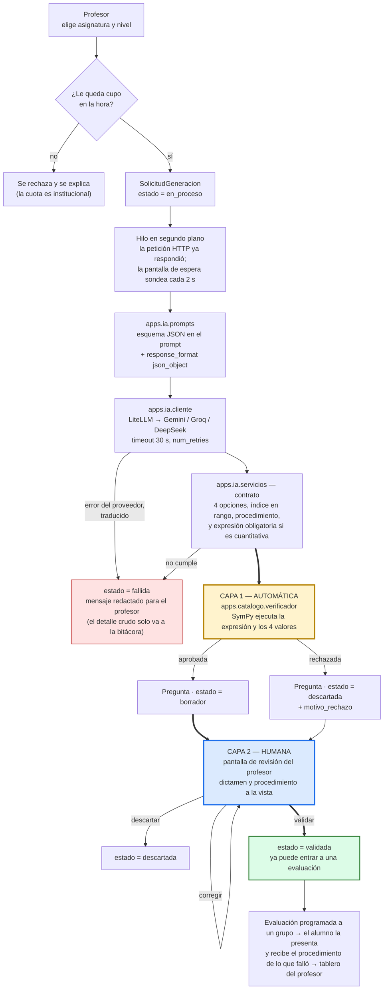
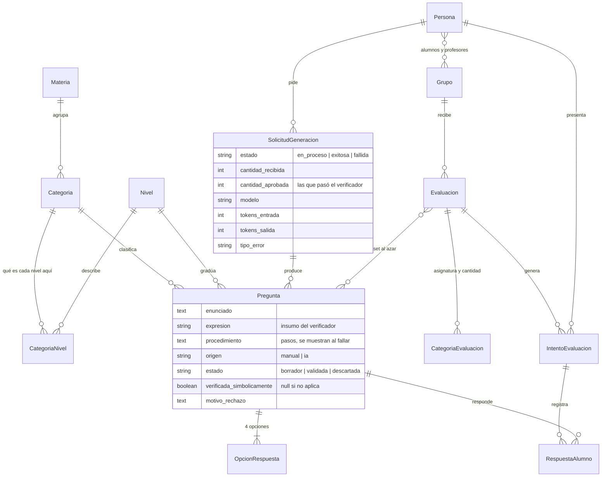
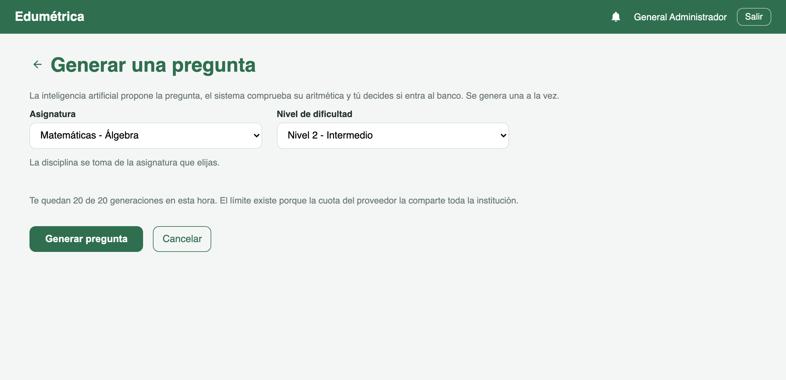
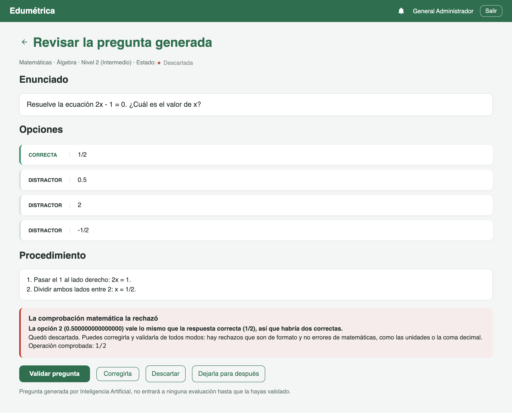
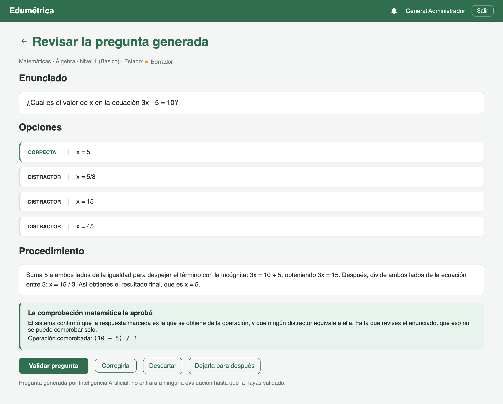
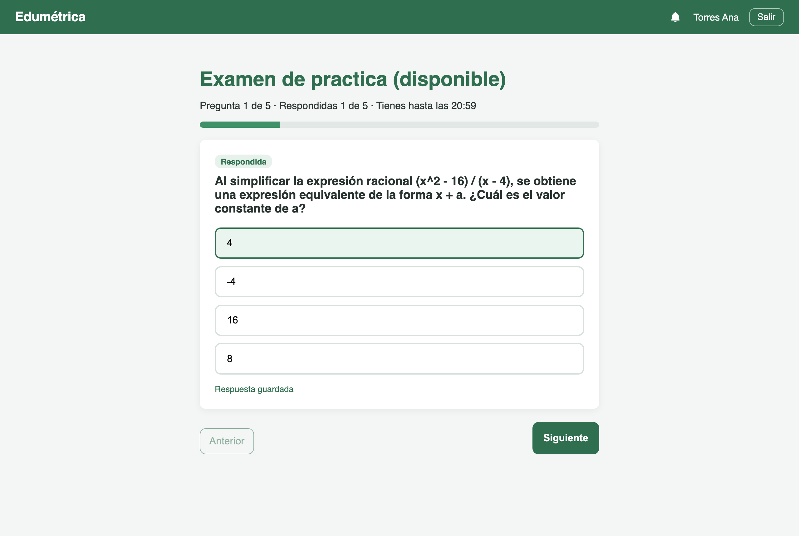
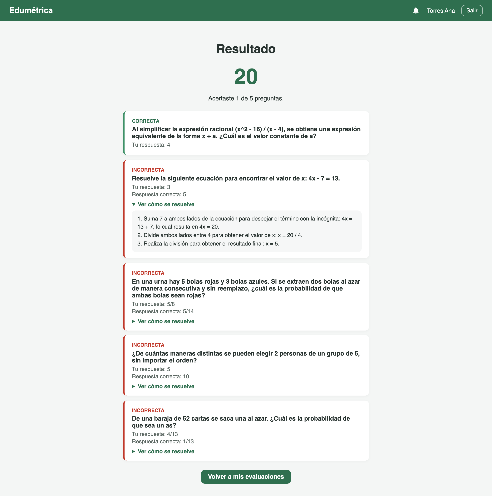
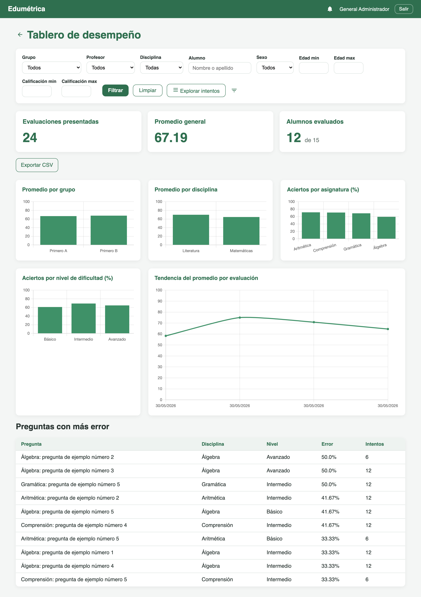

# Edumétrica

Sistema de evaluación diagnóstica de matemáticas para bachillerato: genera
reactivos de opción múltiple con un modelo de lenguaje, **los verifica
ejecutándolos contra SymPy antes de que una persona los vea**, y solo los
libera al banco cuando un profesor los aprueba. Django 6 + SymPy + LiteLLM.

Software de tesis para el título de Licenciado en Ingeniería de Software
(Miguel Ángel Murillo González). Es un prototipo funcional, no un producto
desplegado: ver [Estado del proyecto](#estado-del-proyecto).

---

## El problema

Un banco de reactivos estático se agota. Cada evaluación que aplica un profesor
quema preguntas: los alumnos las comparten, y el mismo reactivo aplicado dos
veces al mismo grupo ya no mide nada. Mantener el banco a mano es el cuello de
botella real — escribir un reactivo con distractores plausibles y su
procedimiento paso a paso cuesta bastante más que aplicarlo.

Un modelo de lenguaje resuelve la redacción y no resuelve la aritmética. Devuelve
reactivos convincentes y de vez en cuando se equivoca en el resultado, y en un
sistema de evaluación eso no es un detalle cosmético: **una clave de respuesta
equivocada reprueba injustamente al alumno y además le enseña algo falso.** Peor
todavía es el error que no se ve leyendo: dos distractores que valen lo mismo.
Una opción dice `1/2` y otra dice `0.5`; una dice `2*x` y otra `x + x`. Como
cadenas de texto son distintas y el reactivo parece correcto; matemáticamente
hay dos respuestas correctas y el alumno no tiene manera de acertar.

De ahí la premisa del proyecto: **la salida del modelo no se confía.** Llega al
profesor ya con un dictamen encima, nunca en crudo, y no queda utilizable ni
entra a una evaluación hasta pasar dos filtros: uno automático y uno humano.

---

## Cómo funciona

El flujo completo, desde que el profesor pide un reactivo hasta que queda
aprobado, atraviesa dos capas de validación independientes.

### 1. La petición no bloquea

El profesor elige asignatura y nivel en `/preguntas/generar/`. Antes de llamar
a nadie se revisa el cupo de la hora (`AI_LIMITE_POR_HORA`): la cuota del
proveedor la comparte toda la institución, así que el tope cuenta todas las
solicitudes, salgan bien o mal.

`lanzar_generacion()` registra una fila `SolicitudGeneracion` en estado
`en_proceso`, arranca un hilo y la vista **redirige de inmediato**. La pantalla
de espera sondea `/preguntas/generando/<id>/estado/` cada 2 s. Una generación
tarda unos veinte segundos y con reintento puede llegar al minuto; sostener la
petición HTTP todo ese tiempo no funciona, porque un servidor de producción
suele cortar a los treinta.

### 2. El prompt pide una estructura, no prosa

`apps/ia/prompts.py` declara el esquema JSON exacto en el prompt de sistema, y
`apps/ia/cliente.py` además pide `response_format: {"type": "json_object"}` a
los proveedores que lo aceptan. Son dos cosas distintas y ninguna basta sola:
el modo JSON obliga a que la respuesta sea JSON válido, **no a que tenga la
forma que esperamos**.

Lo interesante del esquema son dos campos que no aparecerían en un generador
de reactivos genérico:

| Campo | Para qué |
|-------|----------|
| `expresion` | La operación de la que sale la respuesta correcta, en formato evaluable (`"2 + 3*4"`). Es el insumo del verificador: sin ella no hay nada que comprobar. |
| `valores` | El valor simbólico de cada opción, en el mismo orden que `opciones`. El verificador compara expresiones, no cadenas de texto. |

Y la separación entre `opciones` (lo que lee el alumno, con sus unidades y su
ortografía) y `valores` (lo que revisa la máquina, en caracteres simples) es lo
que permite tener a la vez un reactivo legible y uno verificable. El prompt
también exige `procedimiento` como lista de pasos — no una justificación de por
qué la respuesta es correcta, sino el camino para resolverlo — y prohíbe LaTeX,
comas decimales, unidades dentro de `valores`, ecuaciones con `=` y valores
redondeados, porque son justo los formatos que el verificador no sabe leer.

### 3. Validación del contrato

`apps/ia/servicios.py` revisa campo por campo lo que llegó: exactamente cuatro
opciones, ninguna vacía, ninguna repetida como texto, `indice_correcto` entero
dentro de rango, `procedimiento` no vacío. Si la asignatura pertenece a una
disciplina marcada como cuantitativa, `exige_expresion=True` y **una pregunta
sin `expresion` o sin `valores` se rechaza aquí mismo** — si pasara, el
verificador contestaría "no aplica" y el reactivo esquivaría la comprobación,
que es exactamente lo que no debe ocurrir.

### 4. Capa 1 — verificación programática (`apps/catalogo/verificador.py`)

La respuesta del modelo se ejecuta contra SymPy. Cuatro reglas:

1. **Todo se interpreta o se rechaza.** La expresión y los cuatro valores deben
   convertirse en expresiones matemáticas válidas.
2. **La opción marcada como correcta debe ser la que resulta de la expresión.**
   Aquí se cachan las claves de respuesta equivocadas.
3. **Ningún distractor puede equivaler a la respuesta correcta.** Este es el
   error que una comparación de textos nunca detectaría.
4. **Ningún distractor puede equivaler a otro**, o el alumno tendría tres
   opciones reales en lugar de cuatro.

Dos detalles que importan más de lo que parecen:

- **No se usa `sympify`.** Esa función evalúa lo que le llegue, y lo que llega
  aquí lo escribió un modelo de lenguaje. El texto pasa primero por una lista
  blanca de caracteres, un tope de longitud, un bloqueo de palabras reservadas
  de Python y después por `parse_expr` con un `global_dict` cerrado, de modo que
  la expresión no pueda alcanzar nada del intérprete. También se atajan `nan`,
  `zoo` e infinitos: SymPy no revienta con una división entre cero, la
  *representa*, y sin ese filtro un reactivo cuya respuesta no existe se daría
  por bueno.
- **La comparación numérica lleva tolerancia de `1e-12`.** Lo bastante estrecha
  para que `0.33` siga siendo distinto de `1/3`, y lo bastante holgada para
  absorber el error del punto flotante binario, donde `0.1 + 0.2` no da
  exactamente `0.3`.

**Cuando el reactivo no pasa, se guarda igual** — estado `descartada`, con el
motivo redactado en español corriente — en lugar de desaparecer en silencio.
Cuántas rechazó la máquina es un dato del proyecto, no basura.

### 5. Capa 2 — aprobación del profesor

Un reactivo que aprueba el verificador **nace en `borrador`, nunca en
`validada`**. Solo las preguntas `activa=True, estado=validada` pueden entrar a
una evaluación (`Pregunta.objects.utilizables()`), así que si alguna ruta nueva
olvidara marcarla, se queda fuera en lugar de colarse sin revisión.

La pantalla de revisión muestra el dictamen del verificador a la vista, el
procedimiento, y cuatro caminos: **validar**, **corregir** (abre el formulario y
regresa al dictamen), **descartar** o dejarla para después. Los reactivos que la
máquina rechazó se muestran igual que los aprobados, con el motivo — es lo que
le da al profesor la confianza de que el sistema sí revisa lo que el modelo
propone.

### Por qué hacen falta las dos capas

No son redundantes: **atrapan errores disjuntos.**

El verificador comprueba consistencia interna, no veracidad. Compara la
respuesta contra la expresión declarada, y ni siquiera recibe el enunciado en
prosa. Un reactivo que pregunte "¿cuánto es 7 × 8?" con `expresion: "2+2"` y
respuesta `4` se aprueba sin problema: la aritmética es impecable y el reactivo
es inservible. Tampoco juzga la redacción, el nivel de dificultad ni si el
reactivo corresponde a su asignatura. Eso le toca al profesor.

Al revés, el profesor lee y aprueba; no va a detectar que `1/2` y `0.5` son la
misma opción en una lista de cuatro, revisando el reactivo veinte. Eso le toca
a la máquina.

Las limitaciones del verificador están escritas en su propio docstring y
**fijadas en pruebas** (`LimitesConocidosTest`), incluidos sus falsos rechazos:
unidades (`"5 cm"`), ecuaciones (`"x = 3"`), incógnitas de más de una letra y
coma decimal. Esos no producen reactivos malos, producen reactivos buenos
descartados, y se corrigen apretando el prompt — no aflojando las reglas.

---

## Arquitectura



Modelo de datos, sin los campos de auditoría:



`Persona` es el usuario único del sistema (`AUTH_USER_MODEL`, login por correo)
con tres roles: administrador, profesor y alumno. En la interfaz, `Materia` se
llama "disciplina" y `Categoria` se llama "asignatura"; el código conserva los
nombres originales.

El **tablero** (`/tablero/`) parte de esos intentos finalizados: tres tarjetas
de resumen, cinco gráficas con Chart.js (promedio por grupo y por disciplina,
aciertos por asignatura y por nivel, tendencia por evaluación), la tabla de las
diez preguntas con más error y exportación a CSV. Los filtros —grupo, profesor,
disciplina, alumno, sexo, rango de edad, rango de calificación— los comparten el
tablero, el listado de intentos y el CSV a través de una sola función
(`_filtrar_intentos()`), y la base de la consulta depende del rol: el profesor
ve solo sus evaluaciones, el administrador todas.

---

## Decisiones técnicas

### LiteLLM como única frontera con el proveedor

`apps/ia/cliente.py` es el único archivo del proyecto que importa `litellm`, y
`apps/ia/proveedores.py` declara cada proveedor con su modelo por omisión, su
variable de entorno y su consola. Cambiar de Gemini a Groq o a DeepSeek es
editar `AI_PROVIDER` en el `.env`; agregar uno nuevo es una entrada en ese
diccionario.

El módulo traduce todos los fallos de la biblioteca a tres errores propios, y la
distinción no es decorativa porque cada uno se atiende distinto:
`ErrorConfiguracionIA` (culpa nuestra, reintentar no sirve),
`ErrorProveedorIA` (cuota, saturación, conexión o modelo caducado, con bandera
`reintentable` y un `tipo`) y `ErrorRespuestaIA` (respondió, pero no cumple el
contrato: hay que ajustar el prompt). El texto crudo del proveedor va a
`detalle_error` y **nunca a la pantalla** — un volcado de JSON hace pensar al
profesor que el sistema se rompió, cuando el problema es de quien atiende.

*Trade-off:* una capa más entre el código y el proveedor, con su propio
comportamiento que hay que conocer. `litellm.drop_params = True` descarta en
silencio los parámetros que el proveedor activo no soporta — cómodo, y también
significa que un parámetro mal puesto no falla, se ignora. Reintenta por dentro
sin dejar rastro, así que no se puede atribuir cuánto de la latencia es
reintento. Y la traducción de errores depende de su taxonomía de excepciones: si
cambia, este módulo se rompe. De ahí el `except Exception` final como red de
seguridad.

### Ante la duda, el verificador no aprueba

`son_equivalentes()` devuelve `None` cuando no puede decidir, y quien llama trata
esa duda como rechazo — no como aprobación. Mejor mandar un reactivo bueno a
revisión humana que dejar pasar una clave equivocada. Lo mismo con el análisis:
no `sympify`, sino lista blanca de caracteres + bloqueo de palabras reservadas +
`parse_expr` con diccionario de nombres cerrado.

*Trade-off:* falsos rechazos, y no pocos. Unidades, ecuaciones, coma decimal y
respuestas redondeadas se rechazan a propósito, y aceptar redondeos debilitaría
la regla más valiosa del módulo (la detección de distractores equivalentes). El
costo se paga en el prompt, que tiene que pedir el formato exacto, y en
reactivos buenos que mueren por escribir `0,5`.

### Hilo y sondeo en lugar de cola de tareas

La generación corre en un `threading.Thread` y la pantalla sondea cada 2 s. Una
cola de tareas exigiría otro servicio corriendo, y el proyecto ya había
resuelto un problema parecido —avisarle al alumno que el profesor cerró la
evaluación— con sondeo cada 8 s en lugar de WebSockets. Mismo trato.

*Trade-off:* el hilo muere con el proceso. Un reinicio del servidor a media
llamada dejaría la solicitud en `en_proceso` para siempre y a la pantalla
contando segundos sin remedio, así que `_se_quedo_a_medias()` le concede el
peor caso del proveedor (todos los intentos agotando su `timeout`) más un
margen de gracia y después la da por perdida. Y el hilo escribe en SQLite
mientras el sondeo lee: con varios profesores generando a la vez puede salir
`database is locked`. En MySQL, que es lo previsto para producción, desaparece.

### El rechazo se guarda y no se borra al validar

Un reactivo que el verificador rechazó **sí se puede validar** después de
corregirlo — buena parte de sus rechazos son de formato, no errores de
matemáticas. Pero al validarlo **no se limpian** `verificada_simbolicamente` ni
`motivo_rechazo`. Y las solicitudes fallidas se registran fuera de la
transacción que se revierte al relanzar la excepción, o se perdería justo el
dato de cuántos intentos hicieron falta.

*Trade-off:* los datos quedan aparentemente contradictorios —una pregunta
`validada` con `verificada_simbolicamente = False`— y hay que saber leerlos. A
cambio queda separable lo que rechazó la máquina de lo que rescató una persona,
que es la medición que le da sentido al pipeline de dos capas.

---

## Stack

| Capa | Qué |
|------|-----|
| Backend | Python 3.12, Django 6.0, Django REST Framework |
| Verificación | SymPy 1.14 |
| Modelo de lenguaje | LiteLLM 1.100 → Google AI Studio (Gemini) por omisión; Groq y DeepSeek configurados |
| Base de datos | SQLite en desarrollo, MySQL en producción (conmutable por `.env`) |
| Frontend | Plantillas de Django + ModelForms; Vue 3 por CDN en la pantalla del alumno; Chart.js por CDN en el tablero |
| Configuración | python-decouple |
| Pruebas | `unittest` de Django, 336 pruebas |

**Arquitectura híbrida, a propósito.** No es un SPA con API completa: el
administrador trabaja en el admin de Django, el profesor en plantillas con
ModelForms, y solo la pantalla del alumno es interactiva (Vue 3 por CDN dentro
de una plantilla, contra unos pocos endpoints DRF). De ahí que la autenticación
sea por sesión y no JWT, que no haga falta CORS y que **no haya paso de
compilación**: se clona y corre, sin Node. El costo es que la pantalla del
alumno no tiene SFCs, ni tipos, ni empaquetado; migrar a Vite después no toca el
backend.

---

## Cómo correrlo

Requisitos: Python 3.12. Nada más — ni Node, ni Redis, ni Docker. La generación
con IA necesita una llave de proveedor, pero el sistema **arranca y funciona sin
ella** (la pantalla de generación simplemente no se ofrece) y el banco de
matemáticas se puede cargar a mano.

```bash
python3 -m venv venv
source venv/bin/activate
pip install -r requirements.txt

cp .env.example .env          # ajústalo, ver abajo
python manage.py migrate

# 3 niveles, institución y disciplina de ejemplo, y un usuario de cada rol
python manage.py datos_iniciales

# 30 reactivos de matemáticas capturados a mano, en 6 asignaturas y 3 niveles.
# Pasan por el mismo verificador simbólico que los generados.
python manage.py banco_matematicas

python manage.py runserver
```

Login en `/entrar/`. `datos_iniciales` crea `admin@`, `profesor@` y
`alumno@edumetrica.mx`; la contraseña de prueba está en el propio comando. El
admin de Django queda en `/admin/` (requiere `createsuperuser`).

Para poblar el tablero con datos de demostración —alumnos con edad y sexo, dos
grupos, evaluaciones finalizadas con sus intentos y una evaluación abierta para
probar el flujo del alumno:

```bash
python manage.py datos_demo
```

### Variables de entorno

Todas están documentadas en `.env.example` con valores de desarrollo; abajo solo
las que hay que decidir. **Ninguna llave real vive en el repositorio**, y los
valores de esta tabla son de ejemplo.

| Variable | Ejemplo | Para qué |
|----------|---------|----------|
| `SECRET_KEY` | `pon-aqui-una-cadena-larga-y-aleatoria` | Llave de Django. Obligatoria en producción. |
| `DEBUG` | `False` en producción | Con `DEBUG=True` **se desactivan los validadores de contraseña**, para no estorbar al crear usuarios de prueba. |
| `DB_ENGINE` | `sqlite` / `mysql` | Con `mysql` hay que `pip install mysqlclient` y llenar `DB_NAME`, `DB_USER`, `DB_PASSWORD`, `DB_HOST`, `DB_PORT`. |
| `AI_PROVIDER` | `gemini` / `groq` / `deepseek` | Proveedor activo. |
| `GEMINI_API_KEY` | `llave-de-ejemplo-no-sirve` | Solo la del proveedor que vayas a usar. Se consiguen en las consolas que lista `apps/ia/proveedores.py`. |
| `AI_MODEL` | vacío, o `gemini/gemini-2.5-flash` | Sobrescribe el modelo por omisión. Debe incluir el prefijo de LiteLLM. **Los identificadores caducan**: si el proveedor contesta que no existe, se ajusta aquí. |
| `AI_TIMEOUT`, `AI_MAX_RETRIES` | `30`, `1` | Un intento fallido tarda ~21 s; con 2 reintentos una saturación bloqueaba la pantalla de espera dos minutos. |
| `AI_LIMITE_POR_HORA` | `20` | Generaciones por profesor por hora. La cuota es institucional. |
| `EMAIL_BACKEND` | `consola` / `smtp` | Con `consola` el correo se imprime en la terminal. |
| `SITIO_URL` | `https://ejemplo.edu.mx` | Los correos llevan enlaces absolutos. En producción, el dominio real. |

### Probar la generación sin guardar nada

```bash
python manage.py generar_preguntas --materia "Matematicas" --categoria "Aritmetica" --nivel 2
```

Genera un reactivo, le pasa el verificador y dice si lo aprobó o con qué motivo
lo rechazó. No toca la base de datos. Con `--json` muestra la respuesta cruda
del modelo.

### Pruebas

```bash
python manage.py test                # 336 pruebas
python manage.py test apps.catalogo  # una app (ruta de módulo, no etiqueta)
```

El verificador y el módulo de IA se prueban completos **sin red y sin base de
datos**: el cliente va con `mock` y el verificador no depende de nada. Última
corrida verde completa: 336 pruebas en 142 s.

### Cerrar evaluaciones vencidas

El cierre de evaluaciones es perezoso: lo dispara quien mire la pantalla. Para
cerrarlas cuando nadie tiene el navegador abierto (pensado para cron):

```bash
python manage.py cerrar_evaluaciones
```

---

## Capturas

<!-- Sustituye cada línea por la imagen correspondiente. Sugerencia:
     guárdalas en docs/capturas/ y déjalas con estos nombres. -->

**1. Petición de un reactivo** — `/preguntas/generar/`, con el selector de
asignatura y nivel y el contador de generaciones restantes de la hora.

<!--  -->

**2. Revisión con el dictamen del verificador** — la captura más importante:
`/preguntas/<id>/revisar/` mostrando un reactivo **rechazado** con su
`motivo_rechazo` a la vista y los botones de validar, corregir y descartar.

<!--  -->

**3. Revisión de un reactivo aprobado** — el mismo `/revisar/` con el dictamen
en verde y el procedimiento paso a paso.

<!--  -->

**4. Pantalla del alumno** — la app Vue pregunta por pregunta, con la barra de
avance y la cuenta regresiva de los últimos tres minutos.

<!--  -->

**5. Retroalimentación inmediata** — el resultado del intento con el
procedimiento desplegado en las preguntas que el alumno falló.

<!--  -->

**6. Tablero del profesor** — `/tablero/` con las tarjetas de resumen, las
gráficas de Chart.js y la tabla de preguntas con más error.

<!--  -->

---

## Estado del proyecto

**Prototipo funcional de tesis.** Corre de punta a punta en desarrollo: se
generan reactivos contra Gemini, se verifican, se aprueban, se programan
evaluaciones, los alumnos las presentan y el tablero grafica los resultados. Lo
que *no* es: no está desplegado, no se ha usado con alumnos reales, y no hay
métricas de campo.

Deliberadamente este README no reporta números de calidad de los reactivos
generados. La tabla `SolicitudGeneracion` guarda lo necesario para medirlo
—pedidas, recibidas, aprobadas por el verificador, validadas por el profesor,
modelo y tokens— y ese análisis pertenece al capítulo de resultados de la tesis,
no a una cifra suelta aquí.

Lo que falta, en orden de importancia:

- **Nunca se ha corrido en MySQL.** La configuración existe y conmuta por
  `.env`, pero todas las migraciones y pruebas han sido contra SQLite. Además,
  el hilo de generación escribiendo en SQLite mientras el sondeo lee puede dar
  `database is locked` con concurrencia real; es una de las razones para mover a
  MySQL.
- **La regla del prompt contra LaTeX no está confirmada.** El modelo devolvió
  una vez un enunciado con `\log_2(x)` crudo, que el alumno habría visto con las
  barras invertidas literales. Se agregó la instrucción de escribir en texto
  plano pero no se ha comprobado que obedezca de forma consistente.
- **No hay integración continua.** Las pruebas se corren a mano.
- **`requirements.txt` es un `pip freeze` del entorno completo** e incluye
  herramientas del documento de tesis (playwright, python-docx, pypandoc) que la
  aplicación no importa. Hace falta separarlo.
- **El comando `generar_preguntas` no tiene pruebas.** El servicio y el cliente
  sí; la capa de consola no.
- **`SITIO_URL` no cubre el correo de restablecer contraseña.** El aviso de
  evaluación programada ya lo usa; las vistas de `django.contrib.auth` arman su
  enlace por su cuenta y hay que unificarlo antes de desplegar.
- **`temperature` está anunciado para retirarse** en Gemini 3 en adelante. Hoy
  funciona y LiteLLM solo avisa; cuando se retire, la guía de muestreo se mueve
  a las instrucciones del sistema.
- **Sin paso de compilación en el frontend.** Vue por CDN fue una decisión, no
  un descuido, pero la pantalla del alumno crece mal así. Migrar a Vite no
  tocaría el backend.
